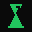

  
  
  # GAMBITS.IN
  
  **"Victory favors the bold."**
  
  
  
  
  

  

    The elite archive of chess gambits. Forget fair play. Master the art of the sacrifice.
     
     
    <a href="https://gambits.in"><strong>[ INITIATE CONNECTION ]</strong></a>
     
     
    <a href="#the-aesthetic">The Aesthetic</a>
    ·
    <a href="#the-mechanics">The Mechanics</a>
    ·
    <a href="#author">Author</a>
  

---

## The Vision

**Gambits.in** is no longer just a parked domain; it is a premium, enigmatic gateway for the boldest players on the board. 

While modern engines strive for "0.00" equality, we believe chess is a battle of psychology and will. This project serves as a highly interactive, cryptic pre-launch teaser. It acts as a gatekeeper for an upcoming platform dedicated entirely to the art of the gambit—where material is temporary, but initiative is forever.

## The Aesthetic: Cypherpunk Grandmaster

We have stripped away the generic and embraced the underground. 

*   **Palette:** Deep Obsidian black backgrounds, stark white typography, and sharp `Blood Red` (`#dc2626`) accents.
*   **Typography:** Monospace hints mixed with sharp geometric sans-serifs. Text doesn't just appear; it glimmers and decrypts onto the screen.
*   **The Mark:** A minimalist, abstract SVG representation of a bisected King (or shattered pieces), drawn dynamically via Framer Motion to represent the beauty of the sacrifice.

## The Mechanics: Interactive Engine

This landing page features cutting-edge micro-interactions to create an immediate "WOW" factor:

1.  **The Gravitational Grid:** A custom HTML5 Canvas implementation of a dark, distorted checkerboard. It mathematically warps and bends around the user's cursor, simulating a gravitational pull or "black hole" effect, complete with a subtle red aura at the singularity.
2.  **Ghost Spotlight Cursor:** The default OS pointer is banished. A custom, spring-physics-driven `mix-blend-difference` ring tracks the user, violently snapping and expanding when hovering over actionable targets.
3.  **Kinetic Choreography:** Powered by `framer-motion`, elements stagger, fade, and draw themselves sequentially, ensuring the page feels alive and responsive to presence.

## Philosophy: The Art of Sacrifice

> "You must take your opponent into a deep dark forest where 2+2=5, and the path leading out is only wide enough for one." — **Mikhail Tal**

In an era dominated by engine preparation and dry positional play, we are bringing back the fire of the Romantic era. Gambits.in is not for those who seek safety. It is for the players who prefer chaos over order, and understand that a sacrifice is not just a calculation, but a declaration of intent.

## The Stack

*   **Core**: Next.js 14 (App Router) & React
*   **Styling**: Tailwind CSS (Custom Dark/Red Theme)
*   **Animation**: Framer Motion
*   **Graphics**: Native HTML5 Canvas API & Custom SVGs
*   **Deployment**: Vercel Edge Infrastructure

## Author

**Ripuranjan Baruah**

*   **Dossier**: [ripu.vercel.app](https://ripu.vercel.app)
*   **GitHub**: [@r-baruah](https://github.com/r-baruah)
*   **Comm Link**: [ripuranjanbaruah@gmail.com](mailto:ripuranjanbaruah@gmail.com)

---

  <small><em>"The hardest game to win is a won game."</em></small> 
  <small>© 2026 Gambits.in. Protocol initialized.</small>

